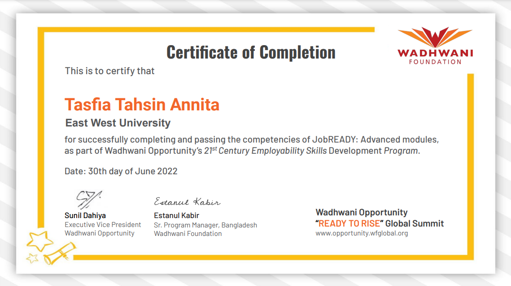
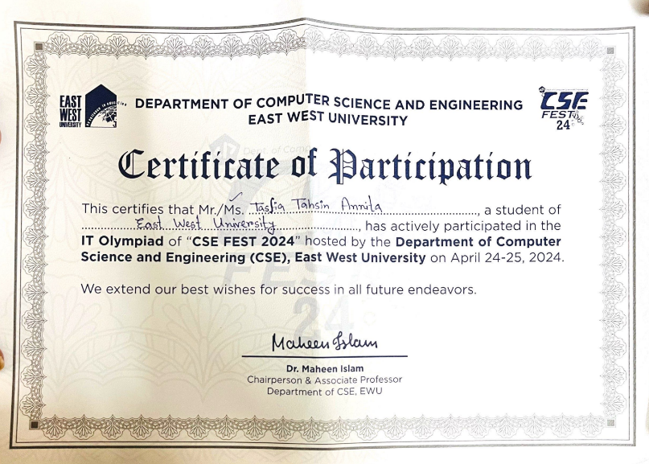
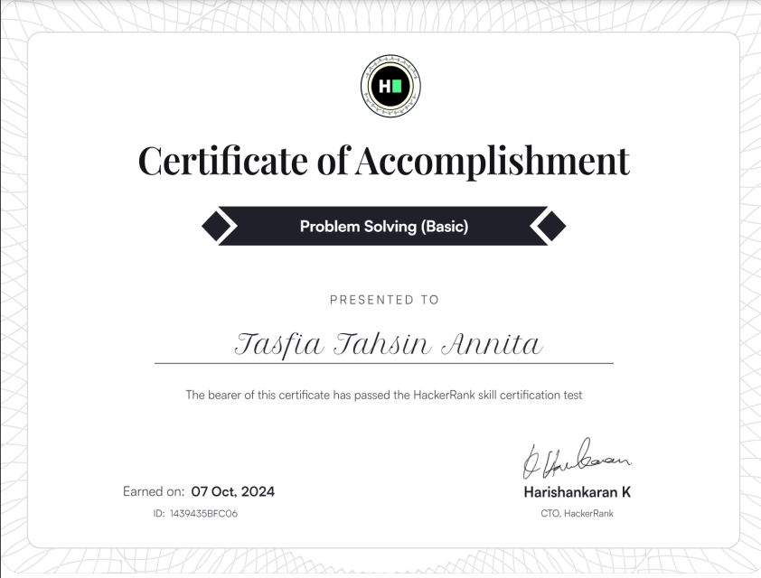

# Hi there, I am Tafia Tahsin Annita

# About me

- 🎓 Currently completeting my Undergraduation in CSE from East West University
- 💼 I’m currently working as an Undergraduate Teaching Assistant in the CSE department of East West University
- 👩‍💻 I'm interested to work as a Faculty/ Software tester / SQA Engineer / Data Analyst
- 📫 How to reach me: tasfiatahsinannita@gmail.com
- 🌐 My Portfolio: <a href="https://tasfiatahsinannita.github.io/Portfolio/">Portfolio</a>

  
  

## Skills

- **Languages**:         

- **Frameworks**: 
- **Tools**:  

<!--<h1 align="center">Github Stats</h1>

  <table>
    <tr>
      <td>
        

          
        

      </td>
      <td>
        
      </td>
    </tr>
    <tr>
      <td colspan="2" align="center">
        

          
        

      </td>
    </tr>
    
  </table>-->

<h1 align="center">Programming Stats</h1>
    <table align="center">
        <tr>
            <td>
                

                    
                

            </td>
            <td>
                

                    
                

            </td>
        </tr>
    </table>

<h1 align="center">Projects</h1>

<table>
  <tr>
    <td>
      

        <a href="#">
        
### [Crime Management System](https://github.com/Glkibria/Crime_Management_System)
 

  

</a>

</td>
    <td>
      

        <a href="#">

### [Flood Detection Using Logistic Regression](https://github.com/TasfiaTahsinAnnita/Flood-Detection-Using-Logistic-Regression)
 

  

</a>

</td>
 </tr>
  
  <tr>

   <td>
      

        <a href="#">
          
### [Design a full fledged network for an organization with multiple subnet](https://github.com/TasfiaTahsinAnnita/Design-a-full-fledged-network-for-an-organization-with-multiple-subnet)
 

  

</a>

</td>
<td>
    

        <a href="#">

### [Blood and Organ donation management system](https://github.com/TasfiaTahsinAnnita/Blood-and-Organ-Donation-Management-System.git)
 

  

</a>

</td>
</tr>

  <tr>

</tr>
</table>
<h1 align="center">Certifications</h1>

<table>
  <tr>
    <td>
      

        <a href="#">
          
Wadhwani - JobReady Employability Skills 

          
        </a>
      

    </td>
    <td>
      

        <a href="#">
          
 National IT olypmiad East West University  

          
        </a>
      

    </td>
    
  </tr>
  
  <tr>
    <td>
      

        <a href="https://www.hackerrank.com/certificates/iframe/1439435bfc06">
          
HackerRank Problem Solving (Basic) Skills Certification Test

          
        </a>
      

    </td>
    <td>
    </td>
  </tr>
</table>

<h1 align="center">Contact</h1>

- 
- 
---

  
 </a> 

